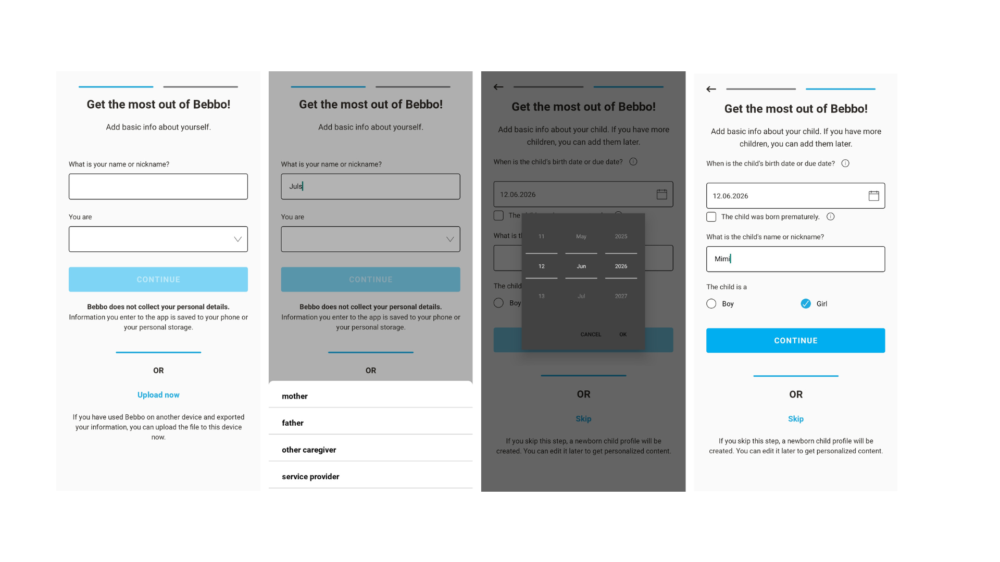

# Creating your Bebbo App profile 

Parents or caregivers are automatically prompted to create a profile for themselves and for the child after installing the Bebbo Parenting App, providing the following: 

- Role in the child’s life.
- Gender of the parents or caregivers. 
- Name of the users or their nicknames. 

For the child’s profile, the following must be provided: 
- The child’s name or nickname. 
- Birth date. 
- Gender. 

Managing the profile will require action after the account creation. 

## Managing your child’s profile 

1. Click the **pencil icon** on your child’s introductory tab shown on the upper part of the Home page. It may also indicate that your child's profile is *“incomplete.”*

**Note: The following instruction is for your discretion .**

2. Click the camera icon to upload your child’s photo.
3. Enter the child’s updated name or nickname. 
4. Update your child’s birth date or due date. 
5. Update your child’s gender. 
6. Save details.

## Managing your profile 

1. Click your child’s icon in the upper right corner of the app. 
2. Go to **“Manage Profile "** and click the pencil icon beside the second tab where “Parents’ detail” is indicated. 
3. Click the first tab indicating your relation to your child (i.e., mother, father, other caregiver, or service provider).
4. Choose the gender, and enter your name. 
5. Save details.

# Updating and Managing Your Family’s Profile 

### Add Another Child 

1. Click the child’s icon in the upper right corner of the app. 
2. Go to **“Manage Profile "** and click **“ + Add Another Child “ ** 
3. Click the camera icon to upload the child’s photo. 
4. Enter your child's given name. 
5. Enter your child’s birth date. 
6. Enter your child’s gender.
7. Save details.

### Add Expected Child 

1. Click the child’s icon in the upper right corner of the app. 
2. Go to **“Manage Profile "** and click **“ + Add Expected Child “ ** 
3. Enter your Due Date. 
4. Enter the Preferred Name for your Child.
5. Save details.

